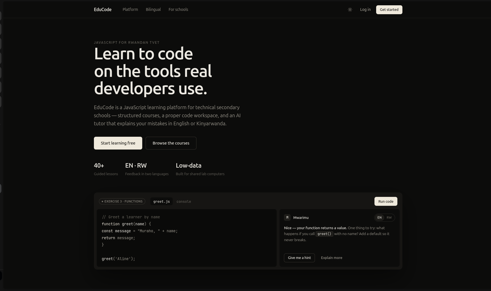
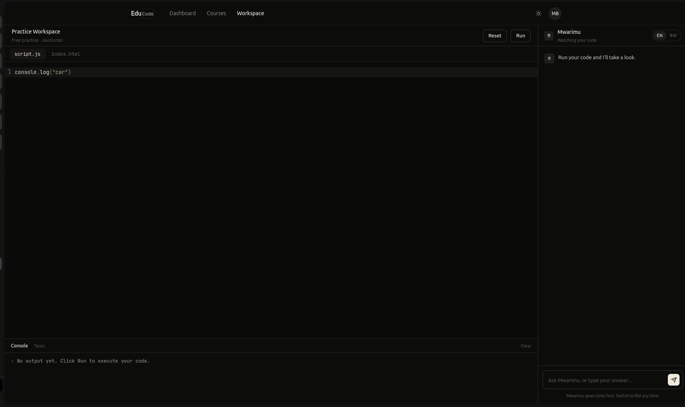
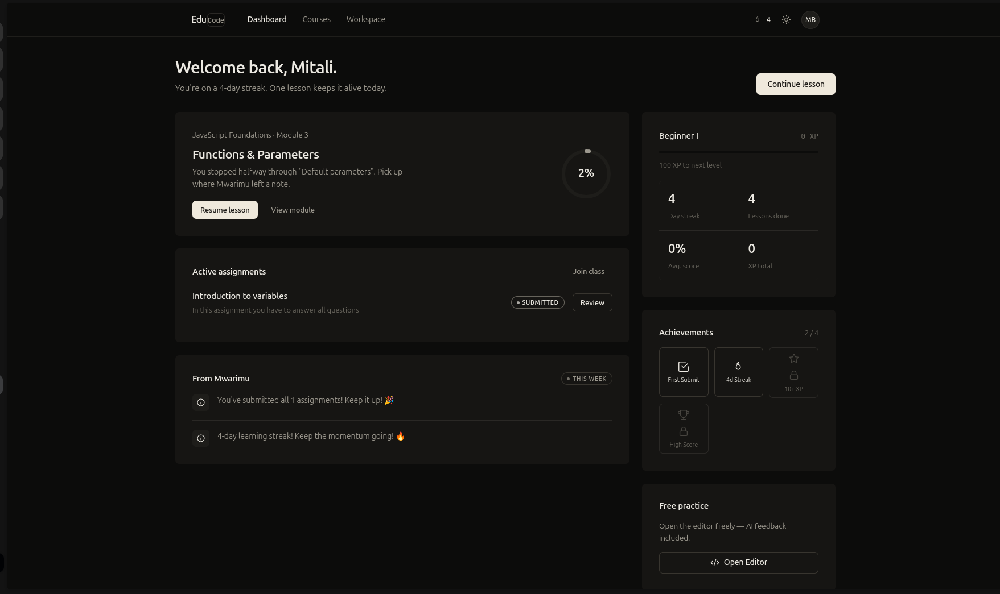
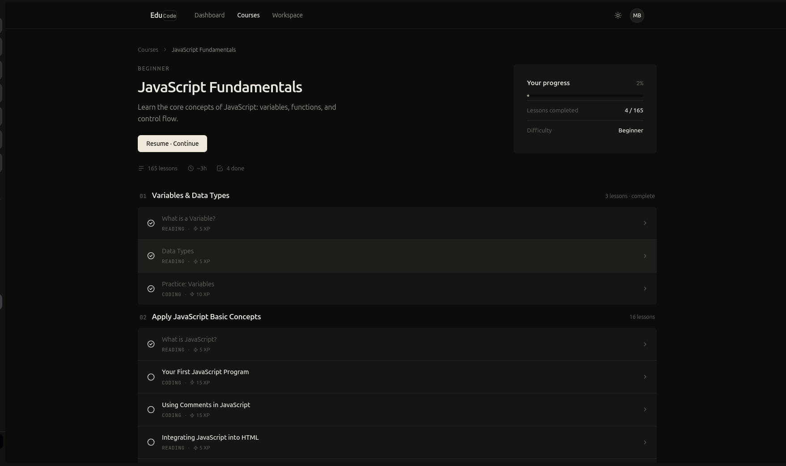
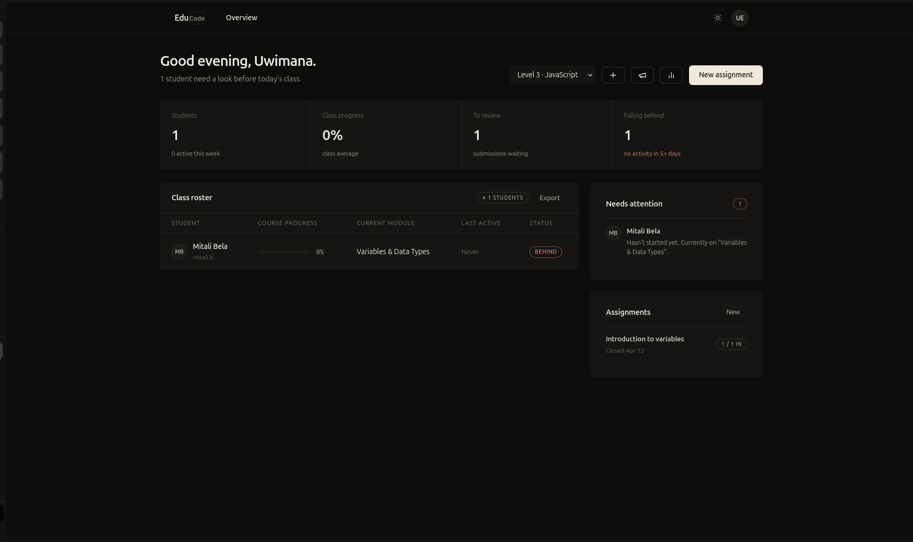
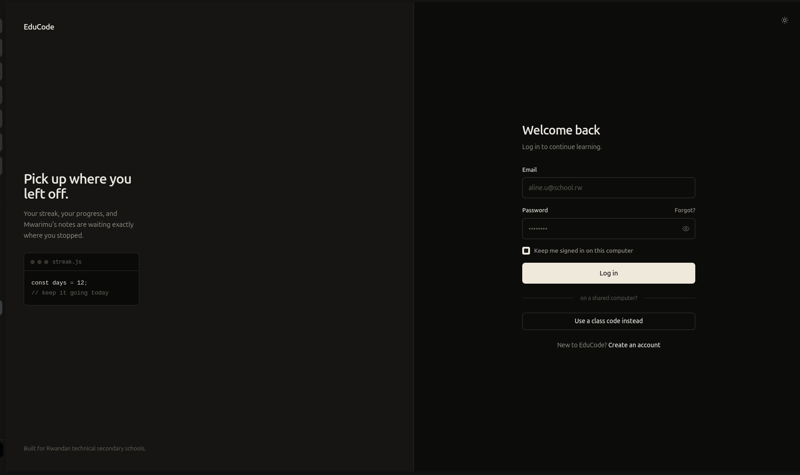
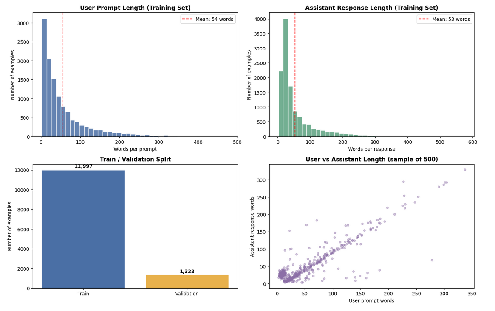
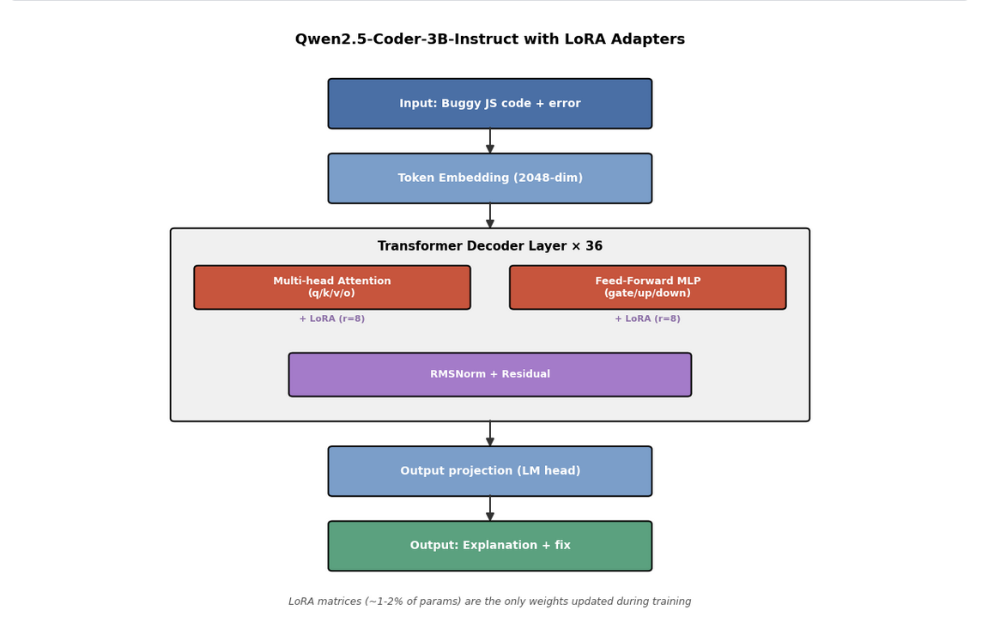
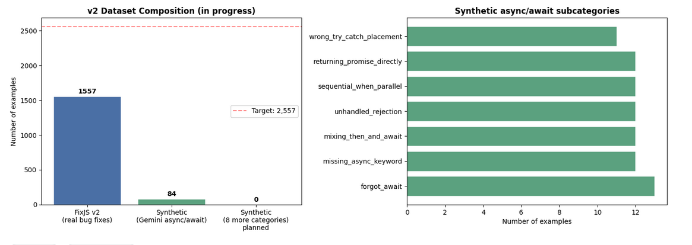

# EduCode Rwanda

> **AI-powered bilingual JavaScript learning platform for Rwandan TVET students.**
> Structured courses, a real code workspace, and an AI tutor that explains your mistakes in English or Kinyarwanda.



---

## About

EduCode Rwanda is a web platform built specifically for Level 3-5 secondary-school students in Rwanda's Technical and Vocational Education and Training (TVET) system. The platform combines structured JavaScript lessons aligned with the Rwandan TVET ICT curriculum, a browser-based code workspace, and a fine-tuned AI coding assistant ("Mwarimu") that gives beginner-friendly feedback in both English and Kinyarwanda.

The platform is designed for the real conditions of Rwandan classrooms: shared lab computers, limited bandwidth, and large class sizes where teachers cannot give individual feedback to every student.

**Live demo:** [educode-rwanda.vercel.app](https://educode-rwanda.vercel.app)
**Repository:** [github.com/DavBelM/educode-rwanda](https://github.com/DavBelM/educode-rwanda)

---

## Key features

### Bilingual AI tutor (Mwarimu)
Mwarimu watches a student's code as they write and gives targeted feedback when they ask. The tutor is hint-first by design: rather than writing the answer, it asks guiding questions and explains *why* a bug happened. Students can toggle between English (EN) and Kinyarwanda (RW) at any time.



### Student dashboard
Streaks, progress, achievements, and a clear "continue where you left off" anchor. The dashboard is designed to feel like a learning home rather than a corporate analytics screen.



### Structured courses
JavaScript Fundamentals is the launch course: 165 lessons across 20 modules, mixing reading lessons and coding exercises. Each lesson awards XP, contributing to streaks and level progression.



### Teacher dashboard
Teachers see a class-level overview: who's behind, who needs review, recent submissions, and class-wide progress metrics. Teachers can create classes, post announcements, and assign specific lessons as homework.



### Authentication
Students can sign in with their school email or join a class directly using a teacher-provided class code, lowering the barrier for students without their own email account.



---

## Technology stack

**Frontend:** React 18 + Vite, Tailwind CSS, CodeMirror 6, custom design system (cream/warm-black monochrome with Geist typography), dark/light theme via `data-theme` attribute.

**Backend:** Supabase (PostgreSQL + Auth + Row-Level Security), Vercel Serverless Functions for the `/api/ai` and `/api/translate` proxy routes.

**AI/ML:**
- **Base model:** [Qwen2.5-Coder-3B-Instruct](https://huggingface.co/Qwen/Qwen2.5-Coder-3B-Instruct)
- **Fine-tuned adapter:** [DavBelaa/qwen25-3b-educode-rwanda](https://huggingface.co/DavBelaa/qwen25-3b-educode-rwanda) (LoRA via QLoRA, trained on Kaggle 2× T4 GPU)
- **Inference deployment:** Hugging Face Inference Endpoint (v1) → Together AI (v2, planned)
- **Kinyarwanda translation:** Google Gemini API at inference time

**Deployment:** Vercel (frontend + API routes), Supabase Cloud (database + auth).

---

## ML pipeline

EduCode Rwanda is in the **ML Track**. The model fine-tuning and dataset construction work is documented in `notebooks/finetune_qwen_educode.ipynb`.

### Dataset (v1: deployed)

The v1 model was trained on 13,330 instruction-format examples (11,997 train + 1,333 validation), sourced primarily from the FixJS bug-fix dataset.



### Model architecture

The fine-tune uses QLoRA: the 3B base model is frozen in 4-bit (NF4) quantization, and LoRA adapter matrices (rank=8, alpha=16) are injected into seven projection points per transformer layer.



Trainable parameters: ~1-2% of the full 3.1B base. Total training time: 9h 42m on Kaggle's 2× T4 GPU environment.

### Dataset (v2: in progress)

Analysis of v1 surfaced two limitations: many original FixJS examples were unsuitable for beginner students (framework-internal code, anonymous fragments), and modern JavaScript constructs (async/await, let/const, arrow functions) were underrepresented because FixJS was mined from 2012 commits, predating ES6.

The v2 pipeline addresses both:



**v2 composition target (~2,557 examples):**
- **FixJS v2** (locked): 1,557 filtered beginner-relevant examples across 5 categories
- **Synthetic generation** (in progress): ~1,000 examples produced via Gemini API with structured-output schema, syntax-validation, and 30% Socratic dialogue framing — covering async/await, let/const scope, arrow functions, destructuring, modern array methods, template literals, and targeted top-ups for operator/equality/off-by-one categories

The v2 retraining and pilot evaluation is scheduled for the capstone window.

---

## Setup

### Prerequisites

- Node.js 20+
- pnpm or npm
- Supabase project (or local Postgres)
- Hugging Face account (for model access)
- Gemini API key (for translation)

### Local development

```bash
# Clone
git clone https://github.com/DavBelM/educode-rwanda.git
cd educode-rwanda

# Install dependencies
pnpm install

# Configure environment
cp .env.example .env.local
# Edit .env.local with your Supabase URL, anon key, HF token, and Gemini API key

# Run database migrations
pnpm supabase db push

# Start dev server
pnpm dev
```

The app runs at `http://localhost:5173`.

### Required environment variables

```
NEXT_PUBLIC_SUPABASE_URL=
NEXT_PUBLIC_SUPABASE_ANON_KEY=
SUPABASE_SERVICE_ROLE_KEY=
HUGGINGFACE_API_TOKEN=
GEMINI_API_KEY=
```

### Running the ML notebook

The Kaggle notebook (`notebooks/finetune_qwen_educode.ipynb`) is configured for the Kaggle 2× T4 GPU environment. To re-run:

1. Upload the notebook to Kaggle
2. Attach the dataset (path expected: `/kaggle/input/datasets/mitalibela/educode`)
3. Enable GPU (T4 ×2) in the runtime settings
4. Run all cells

The notebook documents the training configuration but does not re-execute the 9h 42m training run. The trained adapter is loaded from Hugging Face Hub for evaluation cells.

---

## Deployment plan

**Current (v1):**
- Frontend + API routes: Vercel (auto-deploy from `main` branch)
- Database + auth: Supabase Cloud (Frankfurt region for lowest latency from East Africa)
- Model inference: Hugging Face Inference Endpoint
- Translation: Gemini API

**Planned (v2, pre-pilot):**
- Model inference migrating to Together AI for lower cost-per-token and no cold starts (~$0.20 per million tokens)
- RAG layer added to `/api/ai` using Supabase pgvector, indexing MDN Web Docs and Rwanda TVET ICT curriculum content
- AI feedback logging to Supabase for post-pilot analysis (currently a gap)
- 30+ student pilot at Intango TSS and World Mission HS scheduled for the capstone window

---

## Project status

This is a final-year BSc Software Engineering capstone project at African Leadership University (ALU), Kigali, Rwanda. Supervisor: Ndinelao Iitumba. Capstone defense: late July 2026.

The proposal (Chapters 1-3) has been submitted and the platform is in active development. The v2 ML retraining and the school pilot are the remaining capstone milestones.

---

## Author

**Mitali Bela** — Final-year BSc Software Engineering (ML specialization), African Leadership University.
JavaScript instructor at Intango Technical Secondary School (TVET).
